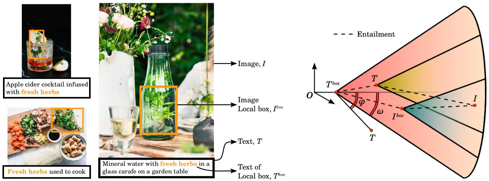

# Compositional Entailment Learning for Hyperbolic Vision-Language Models

Avik Pal, Max van Spengler, Guido D’Amely, Alessandro Flaborea, Fabio Galasso, Pascal Mettes

**Codebase forked and adapted from [MERU](https://github.com/facebookresearch/meru) having [LICENSE](https://github.com/facebookresearch/meru/blob/main/LICENSE).**

<p align="center"></p>

## Installing environment

Set-up codebase with [Conda](https://conda.io/docs/user-guide/install/download.html) using following commands:

```
git clone git@github.com:PalAvik/hycoclip.git
cd hycoclip
conda create -n hycoclip python=3.9 --yes
conda activate hycoclip
```

Install torch and torchvision following instructions at [pytorch.org](https://pytorch.org). Then install this codebase with dependencies using following commands (Note: Using `develop` makes the package editable in-place):

```
python -m pip install --pre timm
python -m pip install -r requirements.txt
python setup.py develop
```

## Pre-trained models

We trained HyCoCLIP along with MERU and CLIP as baselines with corresponding Vision Transformers of different sizes (small, base, and large). These were trained on the [GRIT dataset](https://huggingface.co/datasets/zzliang/GRIT) having 20.5 million grounded image-text pairs for 500,000 iterations with batch size of 768. The model configs are available in [`./configs`](./configs) directory and model checkpoints are uploaded at [huggingface/avik-pal/hycoclip](https://huggingface.co/avik-pal/hycoclip). These can be downloaded with `huggingface-cli` using the following command:

```
huggingface-cli download avik-pal/hycoclip hycoclip_vit_s.pth --local-dir ./checkpoints
```

## Evaluate trained models

We evaluate the models on three tasks on a total of 22 datasets.

1. **Zero-shot image classification**:

Download and symlink the ImageNet dataset ([Torchvision ImageFolder](https://pytorch.org/vision/main/generated/torchvision.datasets.ImageFolder.html)
style) at `./datasets/eval/imagenet`. The Stanford Dogs dataset also needs to be set-up manually using instructions provided in [Pytorch issue 7545](https://github.com/pytorch/vision/issues/7545#issuecomment-1631441616) at `./datasets/eval/cars/stanford_cars`. The evaluation script auto-downloads and caches all other 18 datasets in `./datasets/eval`. To evaluate HyCoCLIP-ViT-small on these 20 datasets, run the following command:

```
python scripts/evaluate.py --config configs/eval_zero_shot_classification.py \
    --checkpoint-path checkpoints/hycoclip_vit_s.pth \
    --train-config configs/train_hycoclip_vit_s.py
```

2. **Zero-shot image and text retrieval**:

Two datasets are supported, COCO captions and Flickr30k captions. Refer to the documentation in [`hycoclip/data/evaluation.py`](./hycoclip/data/evaluation.py) on how to arrange their files in `./datasets/coco` and `./datasets/flickr30k`. To evaluate HyCoCLIP-ViT-small on these 2 datasets, run the following command:

```
python scripts/evaluate.py --config configs/eval_zero_shot_retrieval.py \
    --checkpoint-path checkpoints/hycoclip_vit_s.pth \
    --train-config configs/train_hycoclip_vit_s.py
```

3. **Hierarchical classification**:

We use the WordNet hierarchy of the ImageNet class labels in `./assets/imagenet_synset` for the hierarchcial classification task. Use instructions mentioned in Point 1 to set-up ImageNet evaluation dataset. To evaluate HyCoCLIP-ViT-small on this task, run the following command:

```
python scripts/evaluate.py --config configs/eval_hierarchical_metrics.py \
    --checkpoint-path checkpoints/hycoclip_vit_s.pth \
    --train-config configs/train_hycoclip_vit_s.py
```

